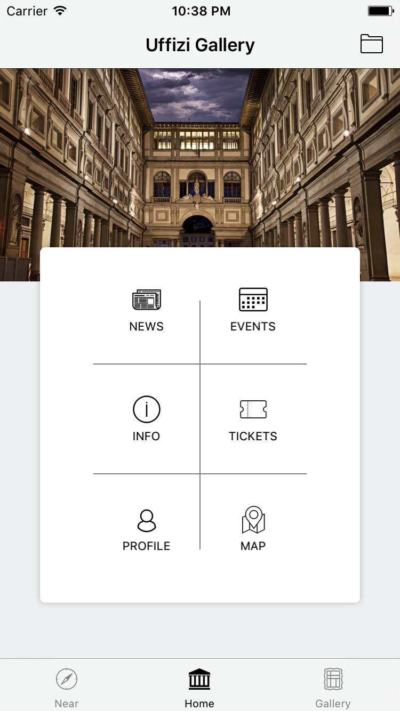
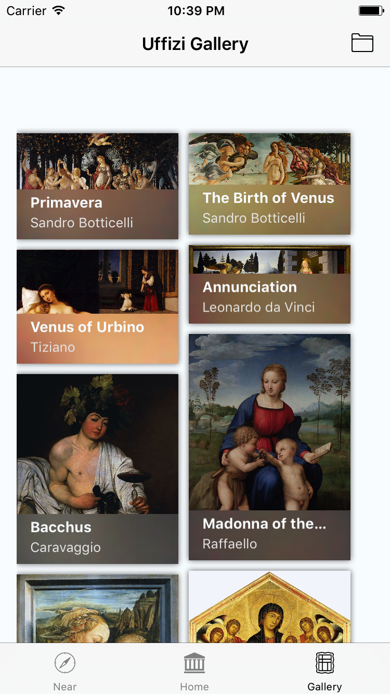
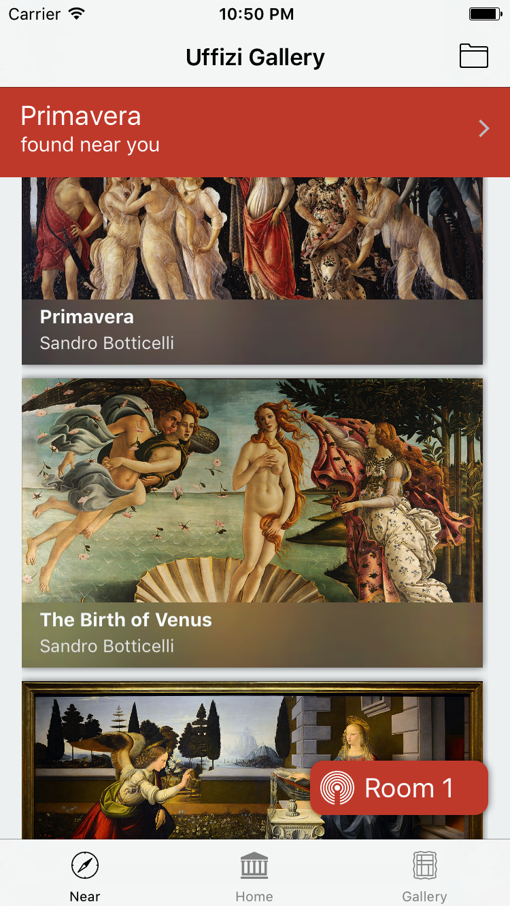
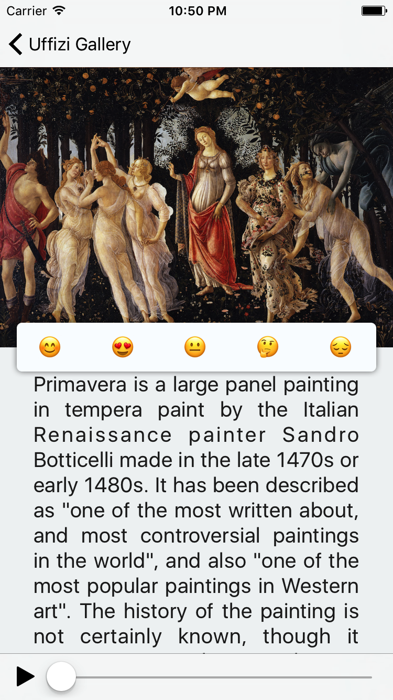
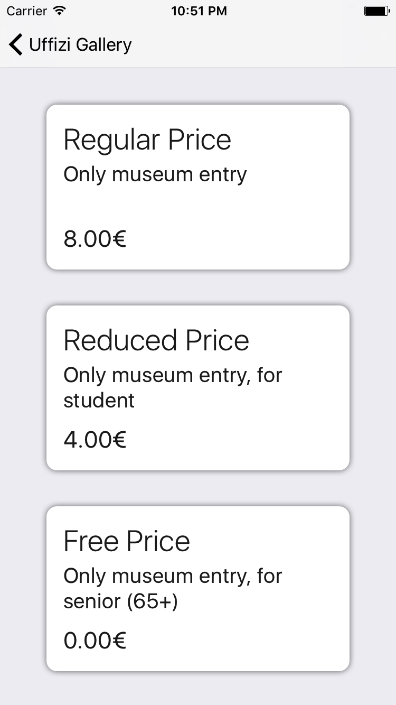
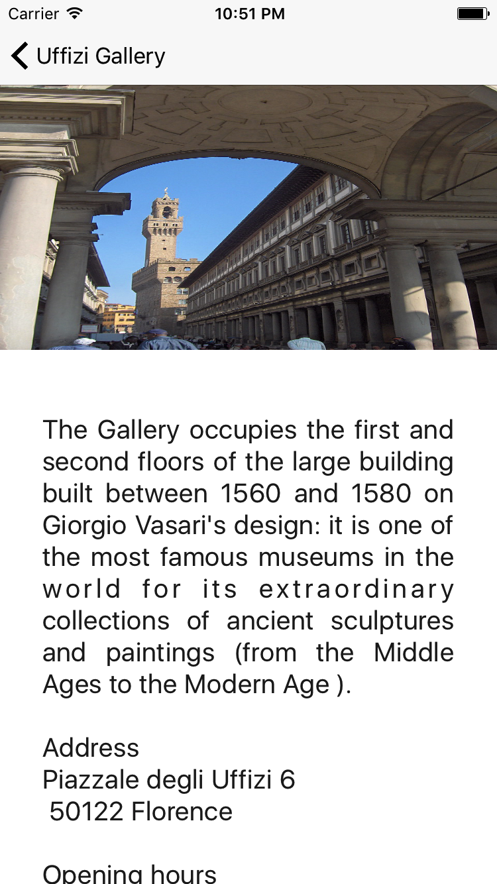
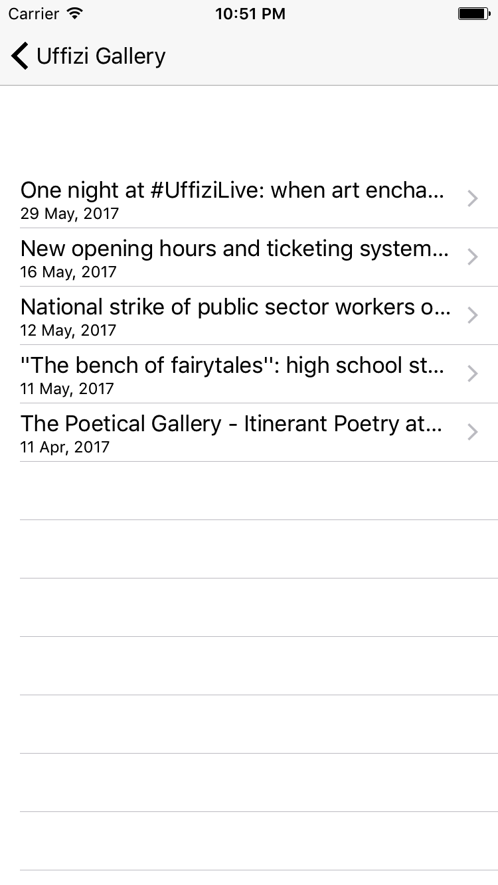
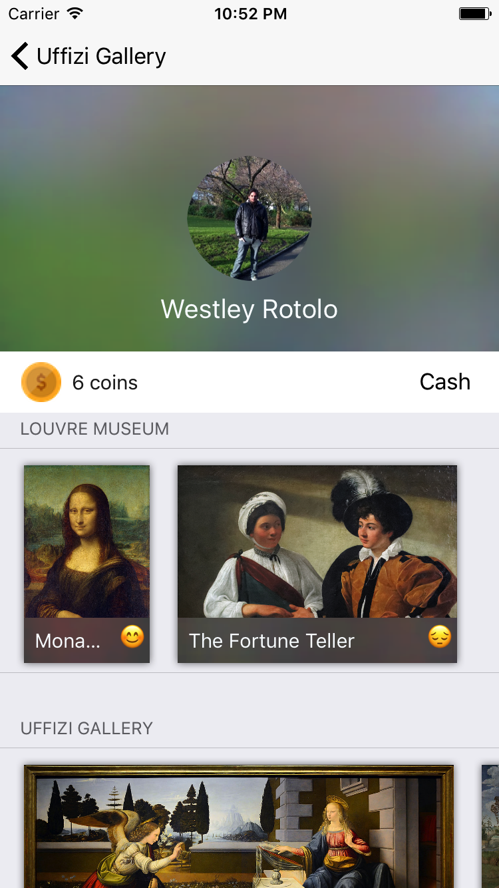
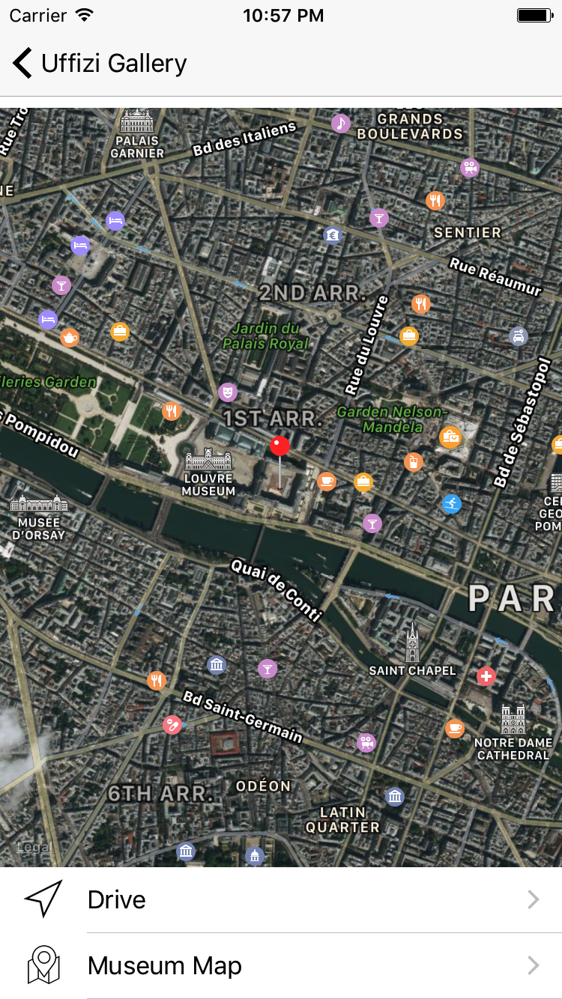

# ArtMuseum

iOS Developer Academy Project

ArtMuseum

 <table style="width:100%">
  <tr>
    <th>Choose Museum</th>
    <th>Home</th>
    <th>Explore</th>
  </tr>
  <tr>
    <td>
      
    </td>
    <td>
      
    </td>
    <td>
      
    </td>
  </tr>
  <tr>
    <th>Near</th>
    <th>Details</th>
    <th>Image Modal</th>
  </tr>
  <tr>
    <td>
      
    </td>
    <td>
      
    </td>
    <td>
      
    </td>
  </tr>
  <tr>
    <th>Tickets</th>
    <th>Info</th>
    <th>Events</th>
  </tr>
  <tr>
    <td>
      
    </td>
    <td>
      
    </td>
    <td>
      
    </td>
  </tr>
  <tr>
    <th>Detail Events</th>
    <th>News</th>
    <th>News Details</th>
  </tr>
  <tr>
    <td>
      
    </td>
    <td>
      
    </td>
    <td>
      
    </td>
  </tr>
  <tr>
    <th>Profile</th>
    <th>Map</th>
    <th>Notification</th>
  </tr>
  <tr>
    <td>
      
    </td>
    <td>
      
    </td>
    <td>
      
    </td>
  </tr>
  <tr>
    <th>Notification Preview</th>
    <th>Force Touch zoom</th>
    <th>Reactions</th>
  </tr>
  <tr>
    <td>
      
    </td>
    <td>
      Go to screenshot folder to watch the video
    </td>
    <td>
      Go to screenshot folder to watch the video
    </td>
  </tr>
</table> 

